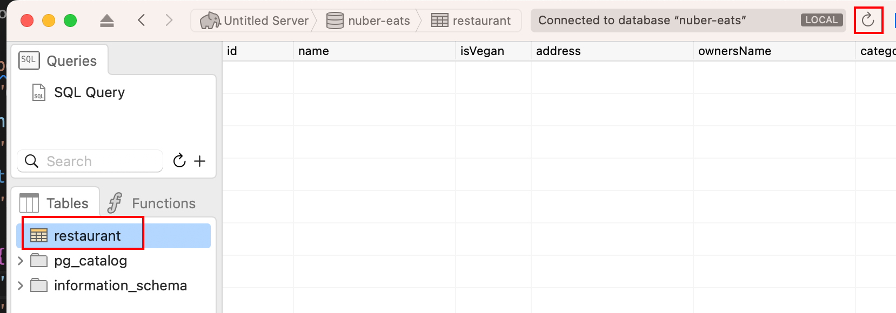

## nuber eats backend

nest.js

## 프로젝트 시작

1. `nest g application`
2. 프로젝트 명 입력: `nuber-eats-backed`
3. `code .` 로 vscode 로 열고
4. `npm i`
5. npm run start:dev

## Nest 기초

### AppModule

graphql 모듈을 모두 AppModule 에 추가해야 합니다.

> `nest g mo restaurants` restaurants 모듈을 생성한다.

```ts
import { ApolloDriver, ApolloDriverConfig } from '@nestjs/apollo';
import { Module } from '@nestjs/common';
import { GraphQLModule } from '@nestjs/graphql';
import { RestaurantsModule } from './restaurants/restaurants.module';

@Module({
  imports: [
    GraphQLModule.forRoot({
      autoSchemaFile: true,
      driver: ApolloDriver,
    }),
    RestaurantsModule,
  ],
  controllers: [],
  providers: [],
})
export class AppModule {}
```

### module

NestJS에서 모듈(module)은 애플리케이션의 부분적인 기능을 모듈화하는 방식으로 구현되는 구성 요소입니다. 모듈은 컴포넌트, 서비스, 미들웨어 및 기타 관련 프로그램 코드를 묶는 데 사용됩니다.

모듈은 @Module 데코레이터를 사용하여 정의됩니다. 이 데코레이터는 해당 모듈에 대한 메타데이터를 제공하며, NestJS가 모듈을 로드할 때 필요한 정보를 제공합니다. 모듈은 또한 프로바이더(provider)를 정의하여 애플리케이션에서 사용될 수 있는 서비스를 제공합니다.

NestJS에서 모듈은 다른 모듈에 의해 가져올 수 있으며, 라우터, 컨트롤러, 미들웨어 및 다양한 프로바이더 등을 정의할 수 있습니다. 모듈을 사용하면 코드를 쉽게 구성하고 유지 보수할 수 있으며, 재사용 가능한 코드를 만들 수 있습니다. 또한 의존성 주입을 통해 모듈 간의 의존성 관리를 쉽게 할 수 있습니다.

```ts
// restaurants/restaurants.module.ts
import { Module } from '@nestjs/common';
import { RestaurantResolver } from './restaurants.resolver';

@Module({
  providers: [RestaurantResolver],
})
export class RestaurantsModule {}
```

### resolvers

GraphQL에서 resolver는 요청된 쿼리에 대한 응답 데이터를 반환하는 함수입니다. 쉽게 말하면, 클라이언트로부터 전송된 GraphQL 쿼리에서 어떤 데이터를 요청하는지를 확인하고, 해당 데이터를 반환하는 역할을 합니다.

resolver 함수는 특정 필드가 요청되었을 때 데이터를 반환하도록 정의됩니다. 각 resolver는 해당 필드가 어떤 데이터를 반환해야 하는지를 결정하는데 필요한 로직을 가지고 있습니다. 예를 들어, 영화 목록을 반환하는 필드의 resolver 함수는 데이터베이스에서 영화 목록을 가져와서 반환할 수 있습니다.

resolver 함수는 일반적으로 데이터베이스와 통신하여 데이터를 검색하고 반환합니다. 이 때, 데이터베이스의 API를 사용하여 데이터를 가져올 수도 있으며, 외부 API를 사용하여 데이터를 가져올 수도 있습니다. 또한, resolver 함수에서는 데이터를 조작하거나 변환하는 로직을 추가하여 반환되는 데이터의 형식을 변경할 수도 있습니다.

GraphQL 스키마는 각 필드에 대한 resolver를 가리키는 지시자를 제공합니다. 따라서 resolver를 정의하여 GraphQL 쿼리에 대한 응답 데이터를 제공할 수 있습니다.

```ts
// restaurants/restaurants.resolver.ts
import { Query, Resolver } from '@nestjs/graphql';

@Resolver()
export class RestaurantResolver {
  @Query((returns) => Boolean)
  isPizzaGood(): boolean {
    return true;
  }
}
```

해당 코드는 `@nestjs/graphql` 모듈을 사용하여 GraphQL resolver를 구현하는 방법을 보여주는 예시 코드입니다.

- `@Resolver()` 데코레이터는 해당 클래스가 GraphQL resolver임을 나타냅니다. 이 resolver는 Restaurant 엔티티와 관련된 쿼리와 뮤테이션을 처리할 수 있습니다.

- `@Query()` 데코레이터는 해당 함수가 GraphQL query를 처리하는 함수임을 나타냅니다. `isPizzaGood()` 함수는 `Boolean` 타입을 반환하며, `returns` 옵션에 해당 타입을 명시하고 있습니다. 이 함수는 `true`를 반환하므로, GraphQL 쿼리에서 `isPizzaGood` 필드를 호출하면 항상 `true`가 반환됩니다.

따라서, 이 코드는 `GraphQL` 쿼리에서 `isPizzaGood` 필드를 호출할 때 항상 `true`를 반환하는 `resolver`를 구현한 것입니다.

http://localhost:3000/graphql


### typeDefs

GraphQL에서 typeDefs는 GraphQL 스키마를 정의하는데 사용되는 타입 정의 언어(Type Definition Language)입니다. typeDefs를 사용하여 GraphQL API의 데이터 모델을 정의하고, 해당 API에서 사용 가능한 모든 쿼리 및 뮤테이션을 설명할 수 있습니다.

typeDefs를 사용하여 GraphQL 스키마를 정의할 때, 쿼리 및 뮤테이션을 정의하는 것 외에도, 스키마에 포함되는 모든 데이터 타입을 정의할 수 있습니다. 이는 API에서 반환되는 데이터 모델에 대한 정확한 설명을 제공합니다.

typeDefs는 GraphQL 서버에서 사용되는 각 객체, 스칼라 유형, 쿼리 및 뮤테이션에 대한 유형 및 매개변수를 정의합니다. 이러한 정의를 기반으로 GraphQL 서버는 클라이언트의 요청을 해석하고 처리할 수 있습니다.

typeDefs는 GraphQL 스키마의 일부이며, 스키마의 모든 정의를 한곳에서 관리할 수 있도록 합니다. 또한, typeDefs를 사용하여 코드의 가독성을 높일 수 있으며, 스키마가 변경될 때 유지보수하기 쉬운 코드를 작성할 수 있습니다.

### Code First

> GraphQL에서 코드 퍼스트(Code First)는 데이터 모델을 기반으로 GraphQL 스키마를 자동으로 생성하는 접근 방식입니다.

코드 퍼스트는 GraphQL 서비스를 더 쉽게 구축하고 유지 보수 할 수 있도록 해줍니다.

기존의 REST API 개발 방식에서는 먼저 API의 URL 구조와 HTTP 요청 및 응답을 정의한 후, 해당 구조를 기반으로 데이터 모델을 작성합니다. 그러나 **GraphQL에서는 데이터 모델을 작성한 후, 해당 모델에 맞게 스키마를 작성합니다.**

코드 퍼스트 방식에서는 데이터 모델을 작성한 후, 해당 모델에 대한 GraphQL 스키마를 자동으로 생성합니다. 이를 통해 개발자는 데이터 모델을 먼저 정의하고, 스키마를 생성할 때 발생할 수 있는 오류를 방지할 수 있습니다. 또한 코드 퍼스트 방식은 자동 문서화와 같은 기능을 제공하여 개발자가 API를 더 쉽게 이해할 수 있도록 돕습니다.

코드 퍼스트 방식을 사용하면 GraphQL API를 쉽게 구축할 수 있으며, 개발 프로세스의 생산성을 높일 수 있습니다.

### entity

Entity는 데이터베이스의 테이블과 매핑되는 TypeScript 클래스입니다.

NestJS에서는 TypeORM 라이브러리를 사용하여 Entity를 작성하고 데이터베이스와 연동합니다. Entity 클래스에는 해당 **테이블의 스키마 정보**와 **데이터 조작을 위한 메서드**들이 포함됩니다. 이러한 Entity 클래스를 통해 데이터베이스와 소통하는 NestJS의 ORM(Object Relational Mapping) 시스템을 구성합니다.

```ts
// restaurants/entities/restaurant.entity.ts
import { Field, ObjectType } from '@nestjs/graphql';

@ObjectType()
export class Restaurant {
  @Field((type) => String)
  name: string;

  @Field((type) => Boolean, { nullable: true })
  isGood?: boolean;
}
```

해당 코드는 @nestjs/graphql 모듈을 사용하여 GraphQL schema의 Restaurant 타입을 정의하는 방법을 보여주는 예시 코드입니다.

@ObjectType() 데코레이터는 해당 클래스가 GraphQL schema의 객체 타입임을 나타냅니다. 이 경우 Restaurant 클래스가 GraphQL schema에서 사용할 객체 타입임을 나타냅니다.

@Field() 데코레이터는 해당 필드가 GraphQL schema에서 사용될 필드임을 나타냅니다. name 필드는 문자열 타입인 String을 반환하며, isGood 필드는 부울 타입인 Boolean을 반환합니다. { nullable: true } 옵션을 추가하여 isGood 필드가 선택적(optional) 필드임을 나타냅니다. 이 옵션을 추가하지 않으면 isGood 필드는 필수 필드로 간주됩니다.

따라서, 이 코드는 GraphQL schema에서 Restaurant 객체 타입을 정의하는 방법을 보여주는 예시 코드입니다. Restaurant 객체는 name 필드와 선택적으로 isGood 필드를 가지며, 이를 사용하여 GraphQL 쿼리에서 Restaurant 객체의 필드를 가져올 수 있습니다.

### arguments

```ts
import { Args, Query, Resolver } from '@nestjs/graphql';
import { Restaurant } from './entities/restaurant.entity';

@Resolver((of) => Restaurant)
export class RestaurantResolver {
  @Query((returns) => [Restaurant])
  restaurants(@Args('veganOnly') veganOnly: boolean): Restaurant[] {
    return [];
  }
}
```

@Args('veganOnly') 데코레이터는 해당 함수가 받는 인자 중 veganOnly 인자가 GraphQL query에서 호출될 때 사용될 인자임을 나타냅니다. veganOnly 인자는 부울 타입의 값으로 받아들이며, true로 설정되어 있는 경우에는 해당 resolver가 반환하는 Restaurant 객체 배열이 비건 음식점만 포함하도록 필터링됩니다.

따라서, 이 코드는 GraphQL 쿼리에서 restaurants 필드를 호출하면 Restaurant 객체 배열을 반환하며, 선택적으로 veganOnly 인자를 받아들여 비건 음식점만 반환할 수 있도록 구현된 resolver를 보여주는 예시 코드입니다.


### Mutation

```ts
// create-restaurant.dto.ts
import { ArgsType, Field } from '@nestjs/graphql';

@ArgsType()
export class CreateRestaurantDto {
  @Field((type) => String)
  name: string;
  @Field((type) => Boolean)
  isVegan: boolean;
  @Field((type) => String)
  address: string;
  @Field((type) => String)
  ownersName: string;
}
```

```ts
// restaurants.resolver.ts
import { Args, Mutation, Query, Resolver } from '@nestjs/graphql';
import { CreateRestaurantDto } from './dtos/create-restaurant.dto';
import { Restaurant } from './entities/restaurant.entity';

@Resolver((of) => Restaurant)
export class RestaurantResolver {
  @Query((returns) => [Restaurant])
  restaurants(@Args('veganOnly') veganOnly: boolean): Restaurant[] {
    return [];
  }
  @Mutation((returns) => Boolean)
  createRestaurant(@Args() createRestaurantDto: CreateRestaurantDto): boolean {
    console.log(createRestaurantDto);
    return true;
  }
}
```


`@Mutation((returns) => Boolean)` 데코레이터는 해당 함수가 GraphQL mutation을 처리하는 함수임을 나타냅니다. 이 경우 createRestaurant 함수는 CreateRestaurantDto 타입의 인자를 받아들이고, Boolean 타입을 반환합니다. 이 함수는 GraphQL 쿼리에서 createRestaurant mutation을 호출했을 때 실행됩니다.

@Args() 데코레이터는 해당 함수가 받는 인자가 GraphQL mutation에서 호출될 때 사용될 인자임을 나타냅니다. createRestaurantDto 인자는 CreateRestaurantDto 타입의 객체를 받아들이는데, 이 객체는 새로운 레스토랑을 생성하기 위한 정보를 담고 있습니다.

createRestaurant 함수는 createRestaurantDto 인자를 콘솔에 출력한 후 true 값을 반환합니다. 이 반환값은 해당 mutation이 성공적으로 실행되었음을 나타냅니다.

따라서, 이 코드는 GraphQL 쿼리에서 createRestaurant mutation을 호출하면 CreateRestaurantDto 타입의 인자를 받아들여 새로운 레스토랑을 생성하고, 이를 콘솔에 출력한 후 true 값을 반환하는 resolver를 보여주는 예시 코드입니다.

### InputType

@nestjs/graphql 모듈에서 제공하는 @InputType() 데코레이터는 GraphQL mutation에서 사용될 인자(argument) 타입을 정의하기 위해 사용됩니다.

GraphQL mutation은 서버 상태를 변경하기 위해 사용되며, 이때 mutation의 인자로 사용될 데이터는 새로운 데이터를 생성하거나 업데이트할 때 필요한 정보를 담고 있습니다. 이때 @InputType() 데코레이터를 사용하여 GraphQL mutation에서 사용될 인자의 타입을 정의하면 코드의 가독성과 유지보수성을 높일 수 있습니다.

@InputType() 데코레이터는 클래스 또는 인터페이스에 적용될 수 있으며, 해당 클래스 또는 인터페이스의 속성(property)을 GraphQL mutation에서 사용될 인자로 정의합니다. 이때 각 속성은 @Field() 데코레이터를 사용하여 GraphQL schema에서 해당 필드를 나타내며, 필요한 경우 각 필드에 대한 유효성 검사(validation) 로직을 추가할 수도 있습니다.

예를 들어, 레스토랑 정보를 생성하기 위해 name, address, isVegan 등의 정보가 필요한 경우, CreateRestaurantInput과 같은 @InputType() 타입을 정의하여 해당 데이터를 받아들일 수 있습니다. 이렇게 정의된 @InputType() 타입은 GraphQL mutation에서 사용될 인자로 사용되며, 클라이언트에서 서버로 데이터를 전송할 때 해당 타입을 사용하여 데이터를 전달합니다.

## ArgsType

@nestjs/graphql 모듈에서 제공하는 @ArgsType() 데코레이터는 GraphQL resolver에서 사용될 인자(argument) 타입을 정의하기 위해 사용됩니다.

GraphQL resolver는 클라이언트로부터 전달받은 쿼리 또는 뮤테이션에 대한 응답을 생성하기 위해 필요한 인자를 받아들입니다. 이때 @ArgsType() 데코레이터를 사용하여 GraphQL resolver에서 사용될 인자의 타입을 정의하면 코드의 가독성과 유지보수성을 높일 수 있습니다.

@ArgsType() 데코레이터는 클래스에 적용될 수 있으며, 해당 클래스의 속성(property)을 GraphQL resolver에서 사용될 인자로 정의합니다. 이때 각 속성은 @Args() 데코레이터를 사용하여 GraphQL schema에서 해당 필드를 나타내며, 필요한 경우 각 필드에 대한 유효성 검사(validation) 로직을 추가할 수도 있습니다.

예를 들어, 레스토랑 정보를 검색하기 위해 name, address, isVegan 등의 정보가 필요한 경우, FindRestaurantArgs과 같은 @ArgsType() 타입을 정의하여 해당 데이터를 받아들일 수 있습니다. 이렇게 정의된 @ArgsType() 타입은 GraphQL resolver에서 사용될 인자로 사용되며, 클라이언트에서 서버로 데이터를 전송할 때 해당 타입을 사용하여 데이터를 전달합니다.

## Validating ArgsTypes

dto에 class validators 를 사용할수 있습니다.

- `npm i class-validator`
- `npm i class-transformer`

```ts
import { ArgsType, Field } from '@nestjs/graphql';
import { IsBoolean, IsString, Length } from 'class-validator';

@ArgsType()
export class CreateRestaurantDto {
  @Field((type) => String)
  @IsString()
  @Length(5, 10)
  name: string;

  @Field((type) => Boolean)
  @IsBoolean()
  isVegan: boolean;

  @Field((type) => String)
  @IsString()
  address: string;

  @Field((type) => String)
  @IsString()
  ownersName: string;
}
```

```ts
import { ValidationPipe } from '@nestjs/common';
import { NestFactory } from '@nestjs/core';
import { AppModule } from './app.module';

async function bootstrap() {
  const app = await NestFactory.create(AppModule);
  app.useGlobalPipes(new ValidationPipe()); // 유효성 검사를 하기 위해 파이프를 추가해줘야 한다.
  console.log('http://localhost:3000/');
  await app.listen(3000);
}
bootstrap();
```

## TypeORM

> TypeORM 을 사용하면 typescript의 장점을 살릴 수 있습니다.

TypeORM은 TypeScript와 JavaScript를 위한 객체 관계 매핑(Object-Relational Mapping, ORM) 프레임워크 중 하나로, 데이터베이스와의 상호작용을 추상화하여 개발자가 더욱 쉽게 데이터베이스를 다룰 수 있도록 도와줍니다.

TypeORM은 다양한 데이터베이스와 상호작용할 수 있으며, MySQL, PostgreSQL, SQLite, Microsoft SQL Server, Oracle, MariaDB 등을 지원합니다. 이외에도 MongoDB와 같은 NoSQL 데이터베이스와도 연동이 가능합니다.

TypeORM은 TypeScript에서 사용하기 적합한 ORM으로, TypeScript에서 제공하는 강력한 기능을 활용할 수 있습니다. 이를 통해 개발자는 타입 안정성(Type Safety), 코드 가독성, 재사용성 등을 높일 수 있습니다.

TypeORM은 Entity, Repository, Query Builder, Migration 등의 개념을 제공하여 데이터베이스와의 상호작용을 보다 쉽고 직관적으로 다룰 수 있습니다. 또한, 데이터베이스 스키마를 TypeScript 클래스와 일치시키는 것으로 데이터베이스 스키마를 관리할 수 있습니다.

TypeORM은 NestJS와 함께 사용할 경우, @nestjs/typeorm 모듈을 사용하여 쉽게 NestJS 애플리케이션에서 TypeORM을 사용할 수 있습니다. 이를 통해 NestJS와 TypeORM을 함께 사용하여 더욱 빠르고 효율적인 개발이 가능해집니다.

### 설치

- `npm i typeorm`
- `npm i @nestjs/typeorm`
- `npm i pg`
- `npm i psql`
- `npm i rxjs`

### DB연결

```ts
import { ApolloDriver, ApolloDriverConfig } from '@nestjs/apollo';
import { Module } from '@nestjs/common';
import { GraphQLModule } from '@nestjs/graphql';
import { TypeOrmModule } from '@nestjs/typeorm';
import { RestaurantsModule } from './restaurants/restaurants.module';

@Module({
  imports: [
    RestaurantsModule,
    TypeOrmModule.forRoot({
      type: 'postgres',
      host: 'localhost',
      port: 5432,
      username: 'hwang-isaac',
      password: '0980',
      database: 'nuber-eats',
      synchronize: true,
      logging: true,
    }),
    GraphQLModule.forRoot({
      autoSchemaFile: true,
      driver: ApolloDriver,
    }),
  ],
  controllers: [],
  providers: [],
})
export class AppModule {}
```

`TypeOrmModule.forRoot()` 메소드를 사용하여 `TypeORM`의 설정을 정의합니다

### 실행

- `npm run start:dev` (nest start --watch 를 실행)

## ConfigService

nest의 configuration module 으로 환경변수를 설정하자

- `npm i @nestjs/config`
- `npm i cross-env` 가상환경을 설정할 수 있다.

```ts
import { ApolloDriver, ApolloDriverConfig } from '@nestjs/apollo';
import { Module } from '@nestjs/common';
import { ConfigModule } from '@nestjs/config';
import { GraphQLModule } from '@nestjs/graphql';
import { TypeOrmModule } from '@nestjs/typeorm';
import { RestaurantsModule } from './restaurants/restaurants.module';

@Module({
  imports: [
    ConfigModule.forRoot({
      isGlobal: true,
      envFilePath: process.env.NODE_ENV === 'dev' ? '.env.dev' : '.env.test',
      ignoreEnvFile: process.env.NODE_ENV === 'prod', // deploy시(production 환경) 환경변수 파일 사용하지 않기
    }),
    // 나머지
  ],
  controllers: [],
  providers: [],
})
export class AppModule {}
```

### validating ConfigService

> 조건이 갖춰지지 않으면 app이 실행되지 않게 하자!

#### joi 설치

- `npm i joi`
- joi 는 스키마 설명 언어입니다.
- joi 로 환경변수의 유효성을 검사하기 위해 설치해줍니다.

`ConfigModule` 에 `validationSchema` 추가

```ts
import * as Joi from 'joi'; // js 로 작성됐기 때문에 이런식으로 import합니다.

ConfigModule.forRoot({
  isGlobal: true,
  envFilePath: process.env.NODE_ENV === 'dev' ? '.env.dev' : '.env.test',
  ignoreEnvFile: process.env.NODE_ENV === 'prod',
  validationSchema: Joi.object({
    NODE_ENV: Joi.string().valid('dev', 'prod').required(),
    DB_HOST: Joi.string().required(),
    DB_PORT: Joi.string().required(),
    DB_USERNAME: Joi.string().required(),
    DB_PASSWORD: Joi.string().required(),
    DB_NAME: Joi.string().required(),
  }),
}),
```

## typeORM and Nest.js

### Entity

Entity는 TypeORM에서 데이터베이스의 테이블과 매핑되는 클래스입니다. Entity 클래스는 데이터베이스에서 테이블을 생성하고, 테이블의 각 열(column)을 클래스의 속성(property)으로 매핑합니다. Entity 클래스는 다음과 같은 형태로 정의됩니다.

```ts
import { Entity, Column, PrimaryGeneratedColumn } from 'typeorm';

@Entity()
export class User {
  @PrimaryGeneratedColumn()
  id: number;

  @Column()
  name: string;

  @Column()
  email: string;

  @Column()
  password: string;
}
```

위 예제에서 @Entity() 데코레이터는 클래스가 Entity임을 나타냅니다. @PrimaryGeneratedColumn() 데코레이터는 id 속성이 기본 키(primary key)로 사용되고, 자동으로 생성되는 것을 나타냅니다. @Column() 데코레이터는 클래스의 속성이 데이터베이스 테이블의 열(column)과 매핑됨을 나타냅니다.

Entity 클래스를 정의한 후, TypeORM을 사용하여 데이터베이스와 상호작용할 수 있습니다. 예를 들어, User Entity를 사용하여 데이터베이스에 새 사용자를 추가하는 코드는 다음과 같습니다.

```ts
import { getRepository } from 'typeorm';
import { User } from './user.entity';

const user = new User();
user.name = 'John Doe';
user.email = 'john.doe@example.com';
user.password = 'password';

const userRepository = getRepository(User);
await userRepository.save(user);
```

위 코드에서 getRepository() 함수는 User Entity의 Repository를 반환합니다. save() 메서드를 사용하여 새 사용자를 데이터베이스에 추가합니다.

Entity는 데이터베이스와 상호작용하는데 필수적인 요소이며, TypeORM을 사용하여 데이터베이스의 테이블과 애플리케이션의 객체 모델을 쉽게 매핑할 수 있습니다.

<hr />

`graphQL` 스키마와 `DB`에 저장되는 실제 데이터의 형식을 만들 수 있다.

```ts
// restaurants/entities/restaurant.entity.ts
import { Field, ObjectType } from '@nestjs/graphql';
import { Column, Entity, PrimaryGeneratedColumn } from 'typeorm';

@ObjectType()
@Entity()
export class Restaurant {
  @PrimaryGeneratedColumn()
  @Field((type) => Number)
  id: number;

  @Field((type) => String)
  @Column()
  name: string;

  @Field((type) => Boolean)
  @Column()
  isVegan: boolean;

  @Field((type) => String)
  @Column()
  address: string;

  @Field((type) => String)
  @Column()
  ownersName: string;

  @Field((type) => String)
  @Column()
  categoryName: string;
}
```

postico 에서 새로고침하면 restaurant 테이블이 나온다.


### Repository

`TypeORM`에서 `Repository`는 데이터베이스와 상호작용하는 데 사용되는 객체입니다. `Repository`는 `TypeORM`이 제공하는 메서드를 사용하여 데이터베이스의 테이블을 조회, 삽입, 갱신, 삭제할 수 있습니다. `Repository`는 `Entity`의 인스턴스를 생성하고 `Entity`와 관련된 CRUD(Create, Read, Update, Delete) 작업을 수행할 수 있습니다.

예를 들어, 다음은 `User` `Entity`의 `Repository`를 생성하고 `User`를 데이터베이스에 저장하는 방법입니다.

```typescript
import { getRepository } from 'typeorm';
import { User } from './user.entity';

const userRepository = getRepository(User);

const user = new User();
user.name = 'John Doe';
user.email = 'john.doe@example.com';
user.password = 'password';

await userRepository.save(user);
```

위 코드에서 `getRepository()` 함수는 `User` `Entity`의 `Repository`를 반환합니다. `save()` 메서드를 사용하여 User Entity의 인스턴스를 데이터베이스에 저장합니다.

`Repository`는 Entity에 대한 CRUD 작업을 수행하는 데 사용되는 여러 메서드를 제공합니다. 일부 예시는 다음과 같습니다.

- `find()`: 데이터베이스에서 Entity를 조회합니다.
- `findOne()`: 데이터베이스에서 특정 Entity를 조회합니다.
- `save()`: Entity를 데이터베이스에 저장합니다.
- `update()`: Entity를 데이터베이스에서 업데이트합니다.
- `delete()`: Entity를 데이터베이스에서 삭제합니다.

이러한 메서드를 사용하여 데이터베이스의 데이터를 쉽게 조회, 삽입, 갱신, 삭제할 수 있습니다. `Repository`는 `TypeORM`을 사용하여 데이터베이스와 상호작용하는 데 필수적인 요소입니다.

#### Active Record vs Data Mapper

Active Record와 Data Mapper는 ORM(Object-Relational Mapping) 패턴에서 가장 많이 사용되는 두 가지 구현 방법입니다. 이 둘을 비교해보면 다음과 같은 차이점이 있습니다.

1. 개념적 차이점
   Active Record 패턴은 도메인 객체와 데이터베이스 테이블 간의 매핑을 담당하는 패턴입니다. 즉, 하나의 도메인 객체가 하나의 테이블과 매핑됩니다. 이러한 구조에서는 도메인 객체가 데이터베이스와 직접적으로 상호작용하며, CRUD(Create, Read, Update, Delete) 작업을 수행합니다.

반면에 Data Mapper 패턴은 데이터베이스와 도메인 객체 간의 매핑을 담당하는 패턴입니다. 이러한 구조에서는 도메인 객체가 데이터베이스와 직접적으로 상호작용하지 않습니다. 대신에 Data Mapper가 도메인 객체와 데이터베이스 간의 매핑을 담당하며, CRUD 작업을 수행합니다.

2. 구현 방법의 차이점
   Active Record 패턴은 하나의 클래스가 도메인 객체와 데이터베이스 간의 매핑을 담당합니다. 이 클래스는 도메인 객체와 데이터베이스 테이블 간의 매핑 정보를 가지고 있으며, CRUD 작업을 수행할 수 있는 메서드를 제공합니다.

Data Mapper 패턴은 두 개의 클래스가 필요합니다. 하나는 도메인 객체를 나타내는 클래스이고, 다른 하나는 데이터베이스와 상호작용하는 Data Mapper 클래스입니다. Data Mapper 클래스는 도메인 객체와 데이터베이스 간의 매핑 정보를 가지고 있으며, CRUD 작업을 수행합니다.

3. 유연성 차이점
   Active Record 패턴은 도메인 객체와 데이터베이스 테이블 간의 매핑이 1:1로 고정됩니다. 따라서, 도메인 객체에 대한 CRUD 작업이 매우 간편합니다. 그러나, 복잡한 관계를 가지는 데이터베이스의 경우, Active Record 패턴은 유연성이 떨어질 수 있습니다.

Data Mapper 패턴은 도메인 객체와 데이터베이스 간의 매핑이 유연합니다. 따라서, 복잡한 관계를 가지는 데이터베이스에서도 유연하게 동작할 수 있습니다. 그러나, CRUD 작업을 수행할 때에는 Data Mapper 클래스를 통해야 하기 때문에 구현이 복잡할 수 있습니다.

4. 테스트 용이성 차이점
   Active Record 패턴은 도메인 객체와 데이터베이스 테이블 간의 매핑이 1:1로 고정됩니다. 따라서, 도메인 객체에 대한 CRUD 작업이 매우 간편합니다. 또한, Active Record 클래스는 일반적으로 도메인 객체를 나타내기 때문에, 테스트 용이성이 높습니다.

반면에 Data Mapper 패턴은 도메인 객체와 데이터베이스 간의 매핑이 유연합니다. 따라서, 복잡한 관계를 가지는 데이터베이스에서도 유연하게 동작할 수 있습니다. 그러나, CRUD 작업을 수행할 때에는 Data Mapper 클래스를 통해야 하기 때문에 구현이 복잡할 수 있으며, 테스트 용이성도 떨어질 수 있습니다.

결론적으로, Active Record 패턴은 단순한 애플리케이션에서 유용하며, Data Mapper 패턴은 복잡한 관계를 가지는 데이터베이스에서 유용합니다.
